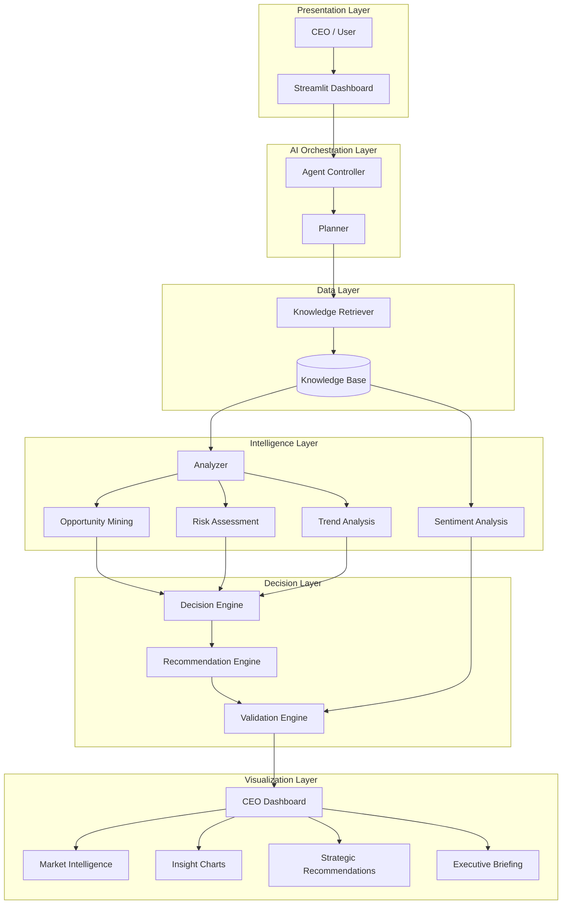

# BMW AI Strategic Intelligence Engine

## Project Description

The **BMW AI Strategic Intelligence Engine** is an AI-powered decision support system designed to simulate how a modern enterprise CEO would analyze business data and make strategic decisions.

The system processes business-related textual data and transforms it into structured executive intelligence, including market opportunities, risks, trends, sentiment analysis, and strategic recommendations.

---

## Objective

The main objective of this project is to build an **AI-driven strategic assistant** that helps decision-makers:

- Understand market dynamics  
- Identify business opportunities and risks  
- Analyze industry trends  
- Generate data-driven strategic recommendations  
- Produce executive-level summaries automatically  

---

## Core Idea

The system mimics a **multi-agent AI pipeline**, where each component performs a specialized role:

- **Planner Agent** → Understands the user question and structures the task  
- **Retriever** → Fetches relevant business knowledge from local dataset  
- **Analyzer** → Extracts insights like opportunities, risks, and trends  
- **Decision Engine** → Converts insights into strategic actions  
- **Recommendation Engine** → Suggests business strategies  
- **Sentiment Analyzer** → Evaluates positive/negative market signals  
- **Streamlit Dashboard** → Visualizes everything for the user  

---

## System Workflow
     User Question → Planning → Retrieval → Analysis → Decision Making → Recommendations → Sentiment Analysis → Dashboard Visualization
## System Architecture

## Technologies Used

- Python
- Streamlit
- Hugging Face Inference API
- Natural Language Processing (NLP)
- AI Agent Workflow
- Strategic Decision Support System
