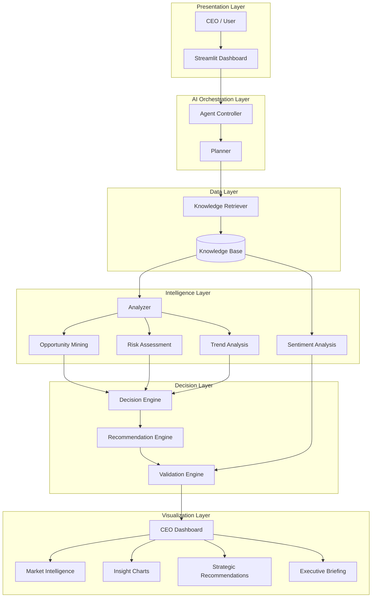

# BMW AI Strategic Intelligence Engine

## System Architecture

## Technologies Used

- Python
- Streamlit
- Hugging Face Inference API
- Natural Language Processing (NLP)
- AI Agent Workflow
- Strategic Decision Support System
